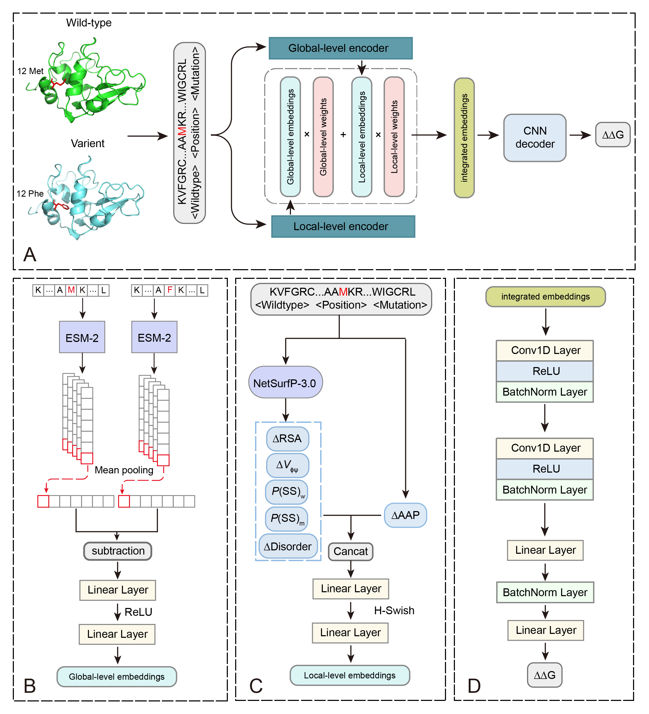

# Predicting the Impact of Missense Mutations on Protein Thermodynamic Stability via Sequence-Based Multiscale Feature Fusion

**MuFaDDG** is a hybrid deep learning framework designed to predict thermodynamic stability changes (ΔΔG) of proteins upon single-point mutations. It integrates both **local-level** and **global-level** representations to improve prediction accuracy. Local features capture residue-level structural and physicochemical properties using traditional computational tools, while global features are derived from pretrained language models that encode full-sequence context. By combining these two perspectives, MuFaDDG provides a comprehensive and interpretable approach for assessing mutation-induced stability changes.

<br>

## 🧠 Model Architecture

The architecture of MuFaDDG consists of three main components:
1. **Dual Feature Extractors**: 
   - A local feature extractor incorporating NetSurfP outputs and amino acid physicochemical descriptors.
   - A global feature extractor leveraging deep protein language models (e.g., ESM-2).
2. **Feature Integration Module**: Concatenates and aligns local and global features.
3. **Decoder**: Predicts ΔΔG values based on the combined feature representation.




---

## 📦 Environment Setup

### 1. Clone the Repository

```bash
git clone https://github.com/PengjiaMa23/MuFaDDG.git
cd MuFaDDG
```

### 2. Install MuFaDDG Environment

```bash
conda env create -f environment.yml
conda activate MuFaDDG
```

### 3. Setup NetSurfP-3.0

NetSurfP is used to extract residue-level structural features. Due to licensing restrictions, you must [apply for academic access](https://services.healthtech.dtu.dk/services/NetSurfP-3.0/) and manually download **NetSurfP-3.0**.

After obtaining the source code:

```bash
# Unzip to the correct location
unzip netsurfp-3.0.Linux.zip -d ./MuFaDDG/

# Enter directory and install
cd netsurfp-3.0/NetSurfP-3.0_standalone/
conda env create --file environment.yml
conda activate nsp3
python setup.py install
pip install -r requirements.txt
```

---

## 🧪 Feature Extraction Pipeline

### 🔹 Input Format

The input CSV should follow this format:

| id | wt_seq | mut_seq | mut_info_Seq | pos_seq |
|----|--------|---------|---------------|----------|

See `./input/Myoglobin.csv` for an example.

---

### 🔸 Step 1: Generate FASTA from Input CSV

```bash
python ./fea_process/set1_get_test_fasta.py --input_csv ./input/Myoglobin.csv
```
**Arguments:**
-`-input_csv`:: Path to the input mutation CSV file (e.g., `./input/Myoglobin.csv`)

**Outputs:** `./input/Myoglobin.fasta`

---

### 🔸 Step 2: Run NetSurfP

Ensure you're in the NetSurfP directory and using the correct environment:

```bash
cd ./MuFaDDG/netsurfp-3.0/NetSurfP-3.0_standalone/
conda activate nsp3
python nsp3.py -m models/nsp3.pth -i ./MuFaDDG/input/Myoglobin.fasta -o Myoglobin
```
**Arguments:**
- `-m`: Path to the trained NetSurfP model file (`nsp3.pth`)
- `-i`: Input FASTA file generated in Step 1
- `-o`: Output folder name to store predictions

**Outputs:** `./netsurfp-3.0/NetSurfP-3.0_standalone/Myoglobin/01/`

---

### 🔸 Step 3: Extract Residue-Level Structural Features

```bash
python ./fea_process/set2_get_netsurfp_fea.py   --input_csv ./input/Myoglobin.csv   --netsurfp_dir ./netsurfp-3.0/NetSurfP-3.0_standalone/Myoglobin/01
```
**Arguments:**
- `--input_csv`: Path to the input mutation CSV file
- `--netsurfp_dir`: Directory where NetSurfP outputs were saved in Step 2

**Outputs:** Structural feature files in `./netsurfp_fea/`

---

### 🔸 Step 4: Extract Full Feature Set (Local + Global)

```bash
python ./fea_process/set3_get_h5.py --dataset Myoglobin
```

**Arguments:**
- `--dataset`: The dataset name prefix (e.g., `Myoglobin` matches `./input/Myoglobin.csv`)

**Outputs:** `./fea_process/h5_data/Myoglobin.h5`

This step will automatically handle both direct and reverse mutation feature generation, including local and global features.

---

## 🔮 Prediction

After feature extraction, run inference using:

```bash
python predict.py --model_dir ./model --dataset Myoglobin --mutation_type d
```

**Arguments**:
- `--model_dir`: Path to trained MuFaDDG model (default: `./model`)
- `--dataset`: Dataset name (e.g., `Myoglobin`)
- `--mutation_type`: Type of mutation to predict:
  - `d`: direct mutations only
  - `r`: reverse mutations only
  - `both`: both direct and reverse

**Output**:
Results are saved in `./result/Myoglobin.csv`:

```csv
id,predicted_ddg
1BZ6A_I28A_d,-0.1094
1BZ6A_L29A_d,-0.2637
1BZ6A_I30A_d,-1.0709
1BZ6A_L32A_d,-0.6071
```


---

## 📌 Citation


---

## 🧑‍💻 Contact

For questions or bug reports, please contact: [pengjiama@nenu.edu.cn]
